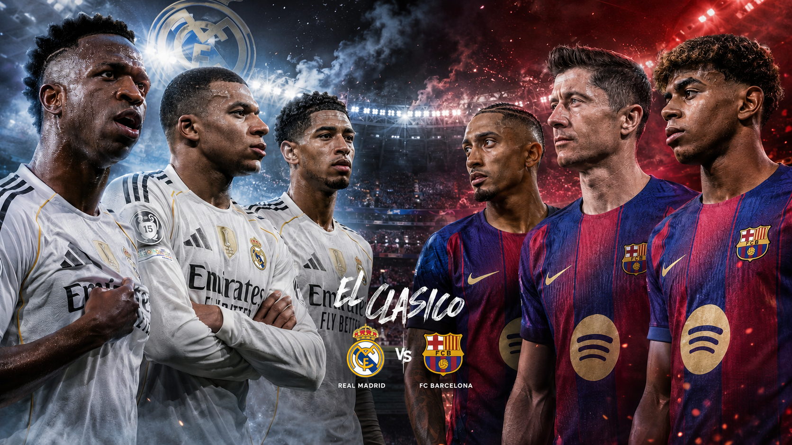
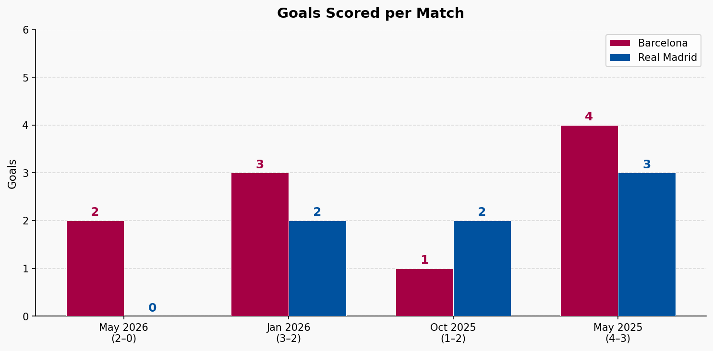
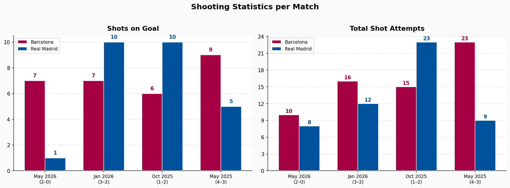
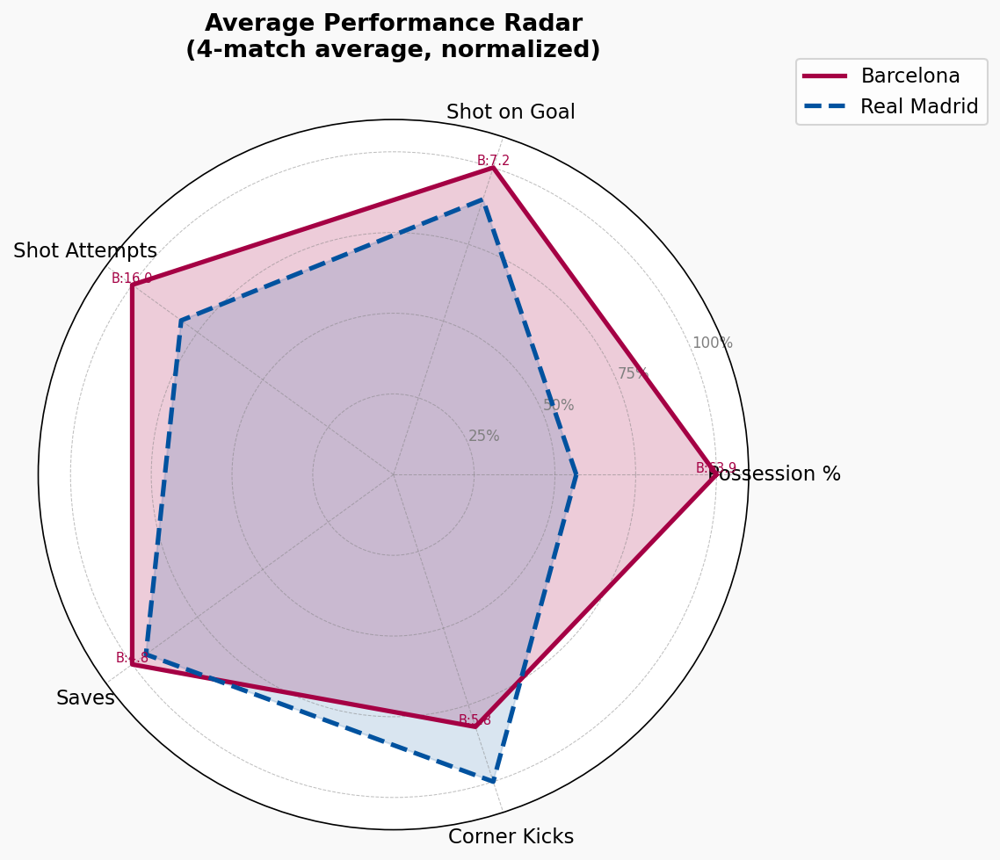

---
# FC Barcelona vs Real Madrid — 4-Match Analysis Report
**Period:** May 2025 – May 2026 | **Competitions:** LaLiga (×3), Spanish Supercopa Final (×1)

---

## 1. Match Results Overview

| # | Date | Competition | Home | Score | Away | Winner |
|---|------|-------------|------|-------|------|--------|
| 1 | 11 May 2025 | LaLiga 2024–25 | Barcelona | **4–3** | Real Madrid | ✅ Barcelona |
| 2 | 26 Oct 2025 | LaLiga 2025–26 | Real Madrid | **2–1** | Barcelona | ✅ Real Madrid |
| 3 | 12 Jan 2026 | Supercopa Final | Barcelona | **3–2** | Real Madrid | ✅ Barcelona |
| 4 | 10 May 2026 | LaLiga 2025–26 | Barcelona | **2–0** | Real Madrid | ✅ Barcelona |

**Head-to-head: Barcelona 3 — Real Madrid 1**

Total goals across 4 matches: **20** (avg 5.0 per match). High-intensity rivalry — only one clean sheet (May 2026).

---

## 2. Goals Analysis

### Goals scored per team

| Team | Total Goals | Avg/Match |
|------|-------------|-----------|
| **Barcelona** | **12** | **3.0** |
| Real Madrid | 8 | 2.0 |

### Scorers of note

- **Raphinha:** Goals in 3 of 4 matches — most consistent Clásico performer
- **Kylian Mbappe:** Hat-trick in May 2025 (5' pen, 14', 70') — sole match where Madrid nearly equalised from 0–3 down
- **Vinicius Junior:** Key in Supercopa Final — struck 45'+2 to make it 1–2 at half-time
- **Marcus Rashford:** Opened scoring in May 2026 match (9')
- **Lamine Yamal:** Goal + assist in May 2025

### Chart insight (Slide 3 — Goals per Match)
Barcelona out-scored Madrid in 3 of 4 matches. Only in Oct 2025 did Madrid score more (2 vs 1). The May 2025 match was highest scoring (7 goals total); May 2026 was most dominant for Barça (2–0 clean sheet).

---

## 3. Possession Analysis

### Per-match breakdown

### Key finding (Slides 1 & 2 — Possession charts)
Barcelona dominated possession in **all 4 matches** — including the Oct 2025 loss. Real Madrid won that game with only 31.6% of the ball, relying entirely on counter-attacking football (Mbappe 22', Bellingham 43'). This is the defining tactical contrast of this rivalry in this period: Barca control the ball, Madrid exploit space.

The stacked possession chart (Slide 2) makes this stark — every bar is majority crimson. Yet Madrid still scored in 3 of 4 matches despite never holding possession advantage, my personal favorite beacuse it looks cool!

---

## 4. Shooting Statistics

### Total Shot Attempts and Shots on Goal

### Shot conversion (goals ÷ shots on goal)

| Team | Goals | Shots on Goal | Conversion |
|------|-------|---------------|------------|
| Barcelona | 12 | 29 | **41.4%** |
| Real Madrid | 8 | 26 | **30.8%** |

### Chart insight (Slide 4 — Shooting Statistics)
Oct 2025 is the standout anomaly: Madrid led shots on goal 10–6 yet both teams scored 2 and 1 respectively — possession-light but shot-heavy Madrid. May 2026 shows extreme divergence: Barca 7 shots on goal vs Madrid's 1, reflecting total dominance that produced the only clean sheet.

---

## 5. Goalkeeper / Saves

| Match | Barcelona Saves | Real Madrid Saves |
|-------|----------------|-------------------|
| May 2025 | 2 | 5 |
| Oct 2025 | 9 | 4 |
| Jan 2026 | 7 | 4 |
| May 2026 | 1 | 5 |
| **Total** | **19** | **18** |

Barcelona's Szczesny was busiest in the Oct 2025 loss (9 saves 😱 including a penalty from Mbappe) — Madrid's shot volume was very high, yet Barca still couldn't win. In May 2026, Barcelona's Joan Garcia made only 1 save all match, reflecting Real Madrid's near-total attacking shutdown.

---

## 6. Radar Summary (Slide 5 — Average Performance)

Across 5 dimensions (possession, shots on goal, shot attempts, saves, corner kicks), Barcelona's radar polygon is significantly larger — dominating possession (avg 59.8%), shot attempts (avg 16/match), and shots on goal (avg 7.25/match). Real Madrid's radar shows strength in corner kicks (avg 5.75/match) and saves (avg 4.5/match, reflecting heavier defensive workload).

The radar confirms what the match-by-match data shows: **Barcelona were the dominant team on all volume metrics**, yet Madrid proved dangerous on efficiency when given the chance.

---

## 8. Key Takeaways

1. **Barcelona dominant period** — 3W/1L record, outscoring Madrid 12–8 across all four matches.
2. **Possession means control, not always victory** — Barca had more ball in all 4 games including their only loss (Oct 2025, 68.4%).
3. **Madrid are counter-attack specialists** — Only match Madrid won came with under 32% possession; Mbappe and Bellingham lethal on transitions.
4. **High-scoring rivalry** — 20 total goals in 4 matches; only May 2026 ended without a Madrid reply.
5. **Barca's shot conversion superior** — 41.4% vs 30.8%. More clinical despite (or because of) higher volume.
6. **Discipline a Madrid weakness** — 15 yellow cards vs 11 for Barca; both teams saw red in the Oct 2025 match.
7. **Supercopa Final most dramatic** — 5 goals in added time split across both halves; Frenkie de Jong red card sealed the chaos.

---

## 9. Data Sources

| Source | Content |
|--------|---------|
| PDF scorecards (4 pages) | Raw match stats per game |
| `matches.csv` | Match results, dates, competition, winner |
| `team_stats.csv` | Per-team stats: possession, shots, cards, saves, corners |
| `match_analysis_report.ipynb` | Python/matplotlib visualisations (Google Colab) |
| `report.pptx` (5 slides) | Chart exports: possession bar, possession stacked, goals, shooting stats, radar |

---

*Report generated from match data in ESPN: May 2025 – May 2026.*
