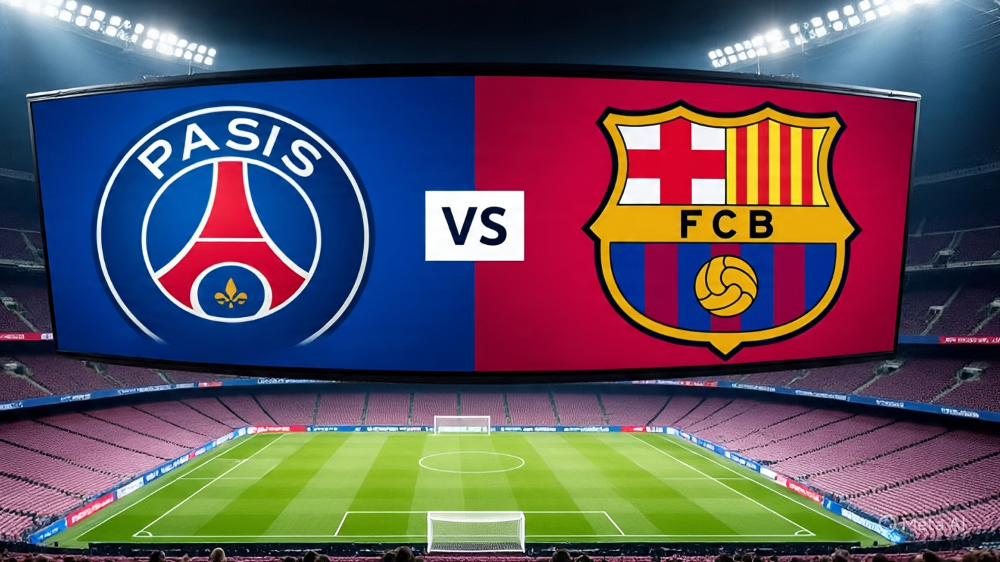
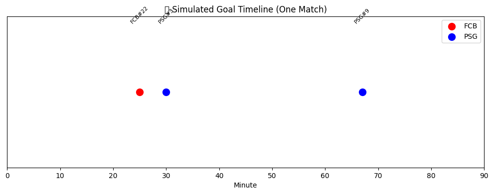
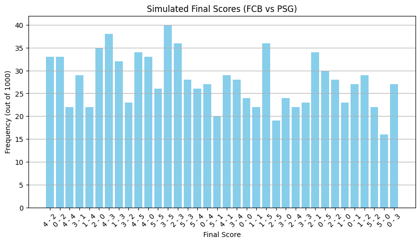

#  Simulating an Unplayed UCL Match  
## FC Barcelona vs Paris Saint-Germain

---

### Intent & Vision

Football is full of what-ifs. I couldn’t stop thinking—what if FC Barcelona had made it past Inter Milan in the semi-finals? We never got to see that dream clash between two European giants: Barcelona vs PSG in the Champions League. So, I decided to bring it to life myself—using data science and simulation to reimagine the match that never was.

Based on how the simulations played out... yeah, I guess it’s PSG’s destiny to finally win the UCL.

We weren’t interested in mere speculation; we wanted to **simulate it with science**.

---

### Methodology

#### 1. Data-Driven Foundations
We curated real player-level data for **FCB** and **PSG** from recent UEFA Champions League matches. Each team’s dataset includes:

- Offensive statistics
- Defensive contributions
- Passing accuracy and volume
- Summary performance metrics
- Expected Goals (xG)

This provided the factual DNA of each squad.

#### 2. Simulation Engine
We constructed a **Monte Carlo simulation model**, running **1000 matches** to reflect the probability distributions of match events like goals, assists, and final outcomes. Match dynamics were modeled based on:

- Player performance
- Randomized but realistic minute-by-minute events
- Weighted offensive potential

#### 3. Event Generation & Timeline
Each match simulation yields:
- A full-time score
- A timeline of goals by minute
- Attribution to individual players

#### 4. Probability Analysis
Out of 1000 simulations:

- **FCB Win Probability**: `41.3%`
- **PSG Win Probability**: `44.2%`
- **Draws & Variations**: Explored through scoreline frequency charts

---

### Visuals

#### Simulated Timeline (One Match)

> _Each dot = goal_ | Red = FCB | Blue = PSG

---

#### Scoreline Distribution from 1000 Simulations

> _A visual frequency of how often each result occurred_

---

### Why This Matters

This project merges **sports analytics, storytelling, and AI** to simulate drama that never occurred on the pitch—but could have. It shows how **data can reimagine sporting events**, and serves as a foundation for future tools like:

- Interactive dream match generators
- Betting simulators with real-world inputs
- AI-driven match commentators

---

> “Football is unpredictable. But data lets us *simulate* the chaos.”

---
